---
puppeteer:
  timeout: 3000 # <= Special config, which means waitFor 3000 ms
---

# 手写公式识别项目

[toc]

## 一. 项目概述

### 1.1 项目简介

实践是检验学习成果的重要环节。在之前的作业当中，同学们已经熟悉了深度学习的基本原理和 Pytorch/TensorFlow 框架的使用方法，但是之前的作业距离实际的开发或科研仍然相差甚远。

为了检验同学们的学习成果，期末的大作业将是以小组的形式开展（每组4~5人），目标是从数据标注开始，训练一个手写公式识别模型。
其中，步骤一是每位同学都需要完成的，后续的步骤请进行合理的分工。
最终的考核形式以**答辩为主**，并且需要每位同学提交实验报告和源代码。
实验代码等数据以组为单位上交，实验报告单独撰写，单独上交，注明分工内容。

相关代码见github仓库：https://github.com/Ladbaby/project_2024_DL

### 1.2 问题定义
需要把图片格式的**数学表达式**转化为文字格式的**LaTex表达式**
<div align="center">
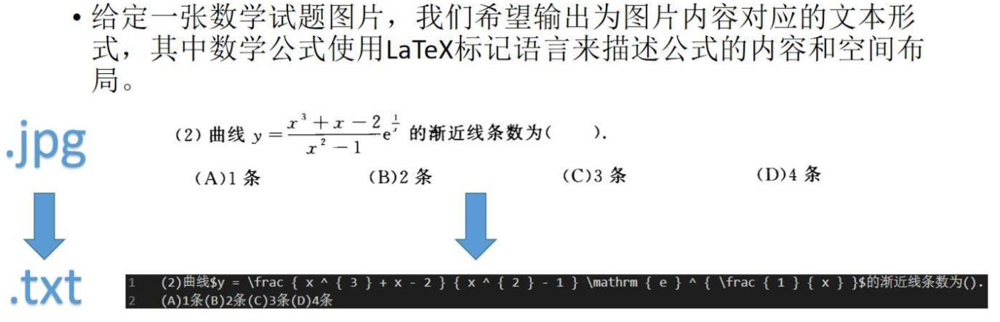
</div>

如上图所示是将印刷体格式的数学表达式进行识别和转化，而我们这次项目聚焦的是手写体的数学表达式。
手写体比印刷体的识别难度更加大，目前还是一个挑战。

如图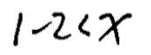，需要识别成 `1-2 < x`


### 1.3 评价指标

1. [BLEU](https://en.wikipedia.org/wiki/BLEU): 衡量模型输出文本的质量
2. [EditDistance](https://www.jianshu.com/p/a617d20162cf): 即 Levenshtein 距离，以取反的百分数呈现，越大越好。例：80% 的 EditDistance 代表需要改动 20% 的内容才能达到 groundtruth
3. ExactMatch: 当预测结果和 groundtruth 一样时才算 100% 准确，否则为 0%，因此同样越大越好。
4. Model Complexity：模型进行推理需要多少的相乘相加运算

### 1.4 完成内容

后面的章节还会详细介绍，这里只是做个概括：

1. 熟悉并使用 labelImg 软件提取公式图片。本次实验会提供**真实的初高中数学试卷**作为数据源给每位同学，每位同学负责其中一部分图片的**公式框选**。（步骤一）
2. 待每位同学完成后，将会收集同学们框选的标注，通过 [mathpix](https://mathpix.com/) 识别后，**取 mathpix 的识别结果作为 ground truth**，再发回给大家作为数据集来训练。（步骤二）
3. 下载获取数据集（步骤三）
4. 利用所提供的代码，完成数据的**清洗+预处理**工作，以便作为模型的输入。（步骤四）
5. 训练**两个模型**：（步骤五）
    - 模型1：Encoder 用 CNN，Decoder 用 RNN
    - 模型2：[CAN](https://arxiv.org/abs/2207.11463) 或是任一 2024 年以后发布的模型
6. 提交模型测试集预测结果，获取测试集成绩（步骤六）
7. 准备**小组答辩**，同时提交**实验报告**和**源代码**。（步骤七）


### 1.5 评分标准（项目总体分值为100分）

1. 数据标注（40分）：**高质量完成**对应标注任务即可得到该部分分数的 85%，**额外标注一份**即可得到得到该部分分数的 100%。注：若标注质量低则酌情扣分。
2. 模型实现（50分，**结合答辩环节评估**）：

   - 模型正确性（30分）：模型1 CNN+RNN（15分）和 模型2 CAN（15分）。评分根据参考代码实现是否正确、实验结果评测指标、代码可复现性和注释等方面来考虑。
   - 模型拓展性（20分）：优化模型、优化数据预处理、讨论任务瓶颈等。有 UI 的根据 UI 的美观、实用性等方面酌情加分。
3. 实验报告（10分）：材料完整性，命名规范性，书写美观性等等。

**注：若发现代码，模型，结果，实验报告有抄袭或伪造情况，则扣除相应部分的分数！**

> PS: 和以往的任务其实不太一样，别惦记着前人留下的东西

## 二，步骤一：标注数据

### 2.1 使用软件介绍

本次标注使用的是 labelImg，是目标检查与识别科研界内广泛使用的开源标注软件。项目地址为：https://github.com/tzutalin/labelImg

### 2.2 软件安装流程

1. 在windows系统下运行。首先下载仓库文件到本地，可以*手动下载zip压缩包后解压*或者*在目标路径下打开git bash并输入以下命令*
    ```shell
    git clone https://github.com/heartexlabs/labelImg.git
    ```

    > 什么，你还没装过 git？快问问 GPT "How to install git on Windows and add it to system path?"
    > 
    > 当然，建议有经验的同学指导萌新通过包管理器 [chocolatey](https://chocolatey.org/) 或者 [Scoop](https://scoop.sh/) 安装
2. 安装 `make`

    make 用于执行 Makefile，假如用过 C/C++ 的编译应该并不陌生
    
    安装方式参考[这里](docs/make.html)，只需要做到 "How to Create a Makefile in Windows?" 之前
3. 记得激活你想要的 Python 虚拟环境。例如要激活用 Anaconda 安装的虚拟环境 (e.g., my_env) 的话:

    ```shell
    conda activate my_env
    ```
4. 进入 labelImg 文件夹，打开 PowerShell 或 cmd，按行依次运行
    ```shell
    pip install pyqt5 lxml
    make qt5py3
    python labelImg.py
    ```

    > PS: 在文件管理器的地址栏里输入 `cmd` 后回车可以直接在当前文件夹打开 cmd（Windows Terminal 则是 `wt -d .`）

<!-- <div align="center">
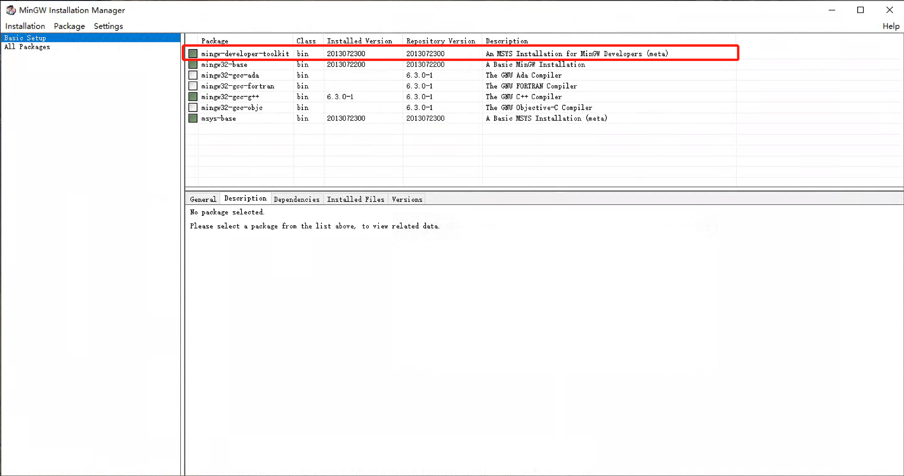
</div> -->

顺利执行 `labelImg.py` 后将自动打开标注软件如下图：

<div align="center">
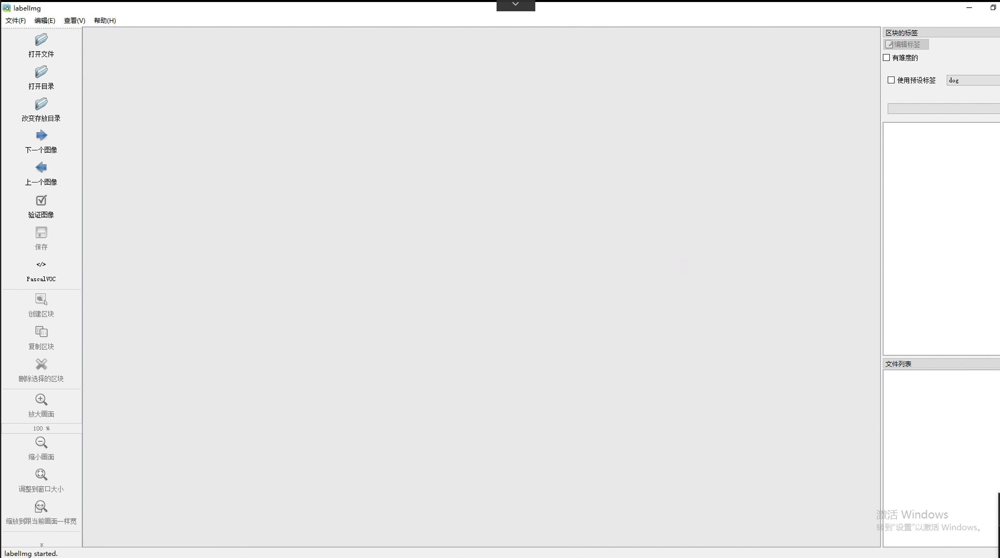
</div>


### 2.3 标注流程

数据标注属于最基础且重要的工作，在真实的生产环境中，提高数据的质量往往比提高算法更加有效，因此企业常常花费大量的时间和经历做一些数据相关的工作。

每位同学会分配60张的试卷图片（预计标注时长 1h），需要额外标注的同学联系助教拿额外 60 张试卷图片，其他标注问题在群里面问助教。

1. 新建文件夹用于存放标注图片和对应的标签

    在自定义的路径下新建 `input_images` 和 `output_annotations` 两个空文件夹。把所分配的数学试题图片放入 `input_images` 中。`output_annotations` 文件夹用于存放后续软件生成的每张图片的xml标签。**待标注完成后重命名并提交 `output_annotations` 文件夹压缩包**
2. 在网址 http://202.38.247.12/share/CuUKY8Cn (密码 12345678，有效时间 30 天，需校园网访问) 下找到自己 `点名册序号` 的文件夹下载（如点名册序号为 1 号则下载文件夹 `1`），并把下载的的图片放入 `input_images` 文件夹中。
3. 修改类别标签文件 `labelImg/data/predefined_classes.txt`，删去原来类别名称，输入 `math`，保存退出。
4. 在 labelImg 的文件夹下，使用命令 `python labelImg.py` 打开标注软件
5. 点击打开目录 (<kbd>Open Dir</kbd>)，选择 `input_images` 文件夹
6. 点击改变存放目录 (<kbd>Change Save Dir</kbd>)，选择 `output_annotations` 文件夹
7. 点击 <kbd>Yolo/Pascal</kbd> 切换到 <kbd>PascalVOC</kbd> 模式。

    <div align="center">
    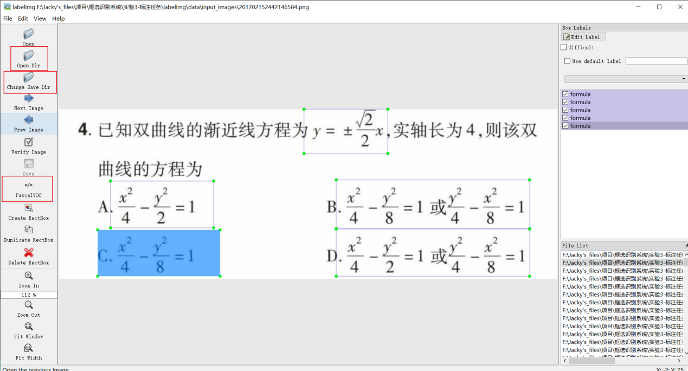
    </div>

8. 点击创建区块（快捷键 <kbd>w</kbd>），圈出图片中的数学表达式（框选规则见下一节），选择标签选择 math，按“<kbd>OK</kbd>”键完成一个框的标注。
   
    当完成当前图片所有框选后，使用快捷键 <kbd>ctrl</kbd>+<kbd>S</kbd> 保存，当前图片的标注将自动保存到 `output_annotations` 文件夹下。之后点击下一张图片（下一张图片快捷键 <kbd>d</kbd>，上一张图片快捷键 <kbd>a</kbd>），重复以上过程直到完成预定数量的标注。

    注：检查 `output_annotations` 文件下是否生成同名的xml标注文件
    <div align="center">
    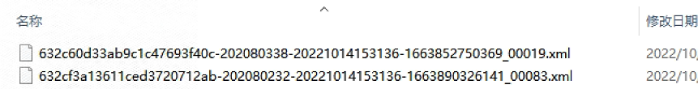
    </div>

    > PS: 提升效率小技巧：（1）熟练使用快捷键 <kbd>w</kbd> 和 <kbd>d</kbd>；（2）在软件右上角勾选使用预设标签

9. 重命名 `output_annotations` 文件夹为 `点名册序号_姓名`，压缩并在提交到指定网址 (http://116.56.134.138/files/大作业/step1_标注上传/)。**提交截至时间：11月19日23:59**

### 2.4 框选数学表达式规则：

框选图片中所有清晰的数学表达式，这里的数学表达式指的是带有上下标字母、字母加数字、公式或者其他任何能够转化为 LaTeX 形式的数学表达式，
标注的原则如下：

1. 认真框选每一个数学表达式，**根据标注质量**评判此部分的分数。
2. 框选**字迹清晰**，**水平方向书写**，**不受批注痕迹影响**的数学表达式。
3. 只有数字或简单字母的不框（比如*5*或*a*），但是组合的数学表达式比如*5a*可以框选。
4. 难易相结合，长短相结合。
5. 不同位置重复的表达式不框选。
6. 题号等无关作答内容的数学表达式不框选。
7. 跳过字迹不清晰的试卷。

以下是一些框选的示例：

<div align="center">
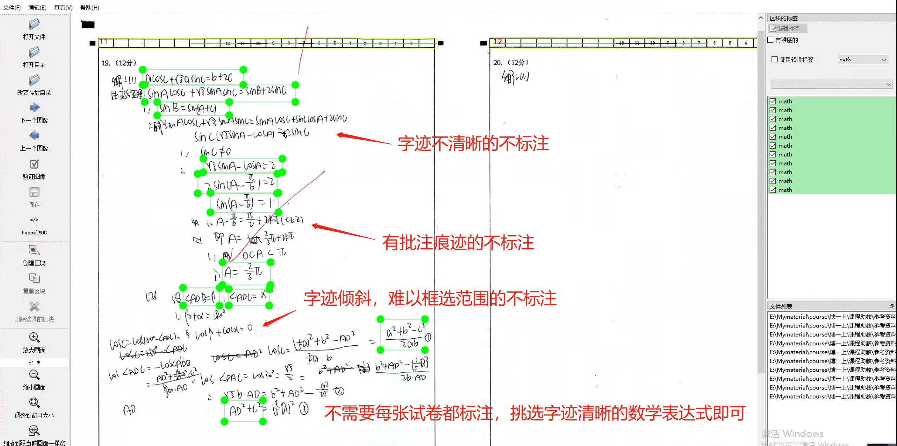
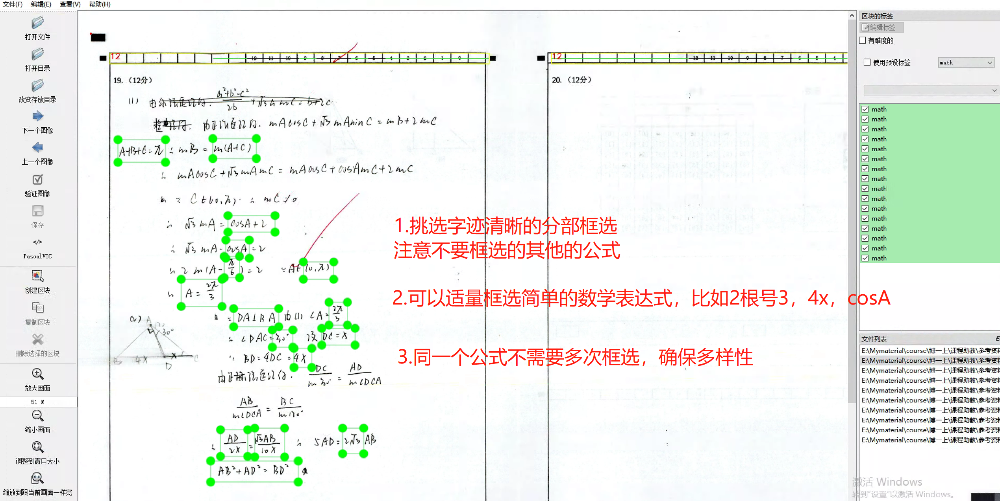
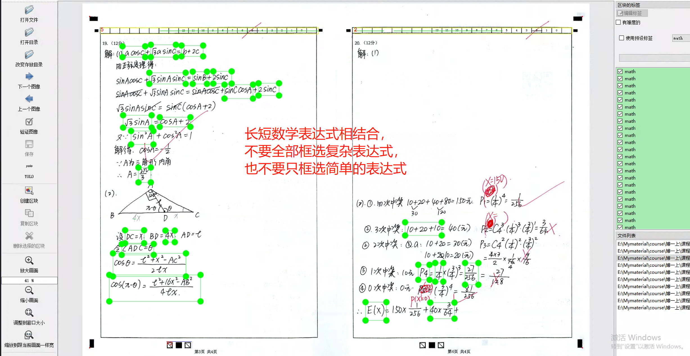
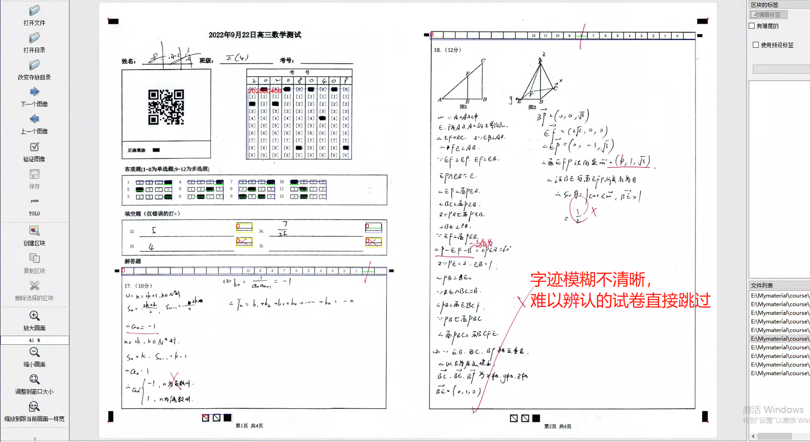
</div>


## 三，步骤二：利用mathpix生成标注图片对应的公式

此步无需同学们完成，pass

## 四，步骤三：获取数据集

在网址 http://116.56.134.138/api/public/dl/nOmA5PDD/download_dl/datasets.zip?token=JRoYrZeFIIKoxIi7ey6ZYiG0KUQZrwkDzIAxqIpz4Z0519MlcrU0yszgjzqn103L9uiBWaWmozD8V_FJBQG8RGeb40bfbPGreS_1UtCaDInfGgbfVwJzL36ajw8Ag_Nz 下载数据集，由于数据集未正式公开，目前仅用作课程作业，**请勿传播**。

> 链接有效期 30 天

格式和说明如下：
```
.
└── datasets
    ├── images      # 图片
    └── labels      # 标签
```

> PS: 由于我们设计于模型训练的代码中动态进行训练/验证集合的分割，所以并没有把原始照片直接分割成训练/验证两个子文件夹。

## 五，步骤四：数据预处理

位于本文件夹下面的 `data_preprocess` 子文件夹里

### 5.1 项目文件功能
```
.
├── preprocess.py # 过滤非法标签，生成 .npy 格式的图片+标签文件。只生成训练和验证集。
├── preprocess_test.py # 类似 preprocess.py，但只生成测试集
└── vocab.txt   # 标签里包含的词汇，觉得不全的话可以自行补充
```


### 5.2 预处理做法

- 运行 `python data_preprocess/preprocess.py`

    该代码生成**训练**和**验证**数据集，具体干的事情：
    1. Tokenization，根据词表进行分词，并根据词表初步过滤数据
    2. 过滤多行数据和error mathpix
    3. 对齐过滤后的数据
    4. 保存为一系列 [.npy](https://numpy.org/devdocs/reference/generated/numpy.lib.format.html) 后缀的文件。其中每个文件包含一个 list，其中的每一项是一个样本对应的 dict，格式如下：

        ```
        {
            'ID': 00000,
            'label': "x ^ { 2 } - 1 3 x + 3 6 < 0",
            'image': np.ndarray of shape (width, height, RGB)
        }
        ```

        `ID` 范围：`00000` ~ `104010`

        > 其实理论上应该是 `000000` （6 个 0 而非 5 个）开头的，没料到有这么多样本。可能是个小坑，需要留一下。

- 运行 `python data_preprocess/preprocess_test.py`

    该代码生成**测试集**，具体干的事情：

    1. 保存为一系列 [.npy](https://numpy.org/devdocs/reference/generated/numpy.lib.format.html) 后缀的文件。其中每个文件包含一个 list，其中的每一项是一个样本对应的 dict，格式如下：

        ```
        {
            'ID': 00000,
            'label': "NOT_AVAILABLE",
            'image': np.ndarray of shape (width, height, RGB)
        }
        ```

        `ID` 范围：`104011` ~ `105060`

        可以看到测试集的标签为 `NOT_AVAILABLE`，因为这些数据是后续模型性能打榜的时候，各位同学需要使用自己训练好的模型，进行预测的标签。

> PS: 关于为什么使用多个 `.npy` 文件来同时存储照片和标签，而不是使用原本 `.png` 和 `.txt` 的文件：文件的 I/O 会引入极大的时间开销，每次存取照片和标签都隐形增加处理耗时
> 
> 划分为多个 `.npy` 而不是只用一个的原因：16 GB 内存会在写入的时候爆炸，划分为多个可以轮流读写，降低内存的使用压力。默认一个 `.npy` 里装 10000 个样本，假如你内存多的话也可以提高这个数字

## 六，步骤五：训练和评估模型

- 模型1：Encoder用CNN，Decoder用RNN

    更多运行说明详见 [model1_LaTeX_OCR_Pytorch/README.md](model1_LaTeX_OCR_Pytorch/README.md)
- 模型2：[CAN](https://arxiv.org/abs/2207.11463)

    更多运行说明详见 [model2_CAN/README.md](model2_CAN/README.md)

## 七，步骤六：测试模型

### 7.1 评估概述

- 是否必须：非强制，是否测试及测试成绩会作为打分参考
- 开放时段：12月13日~12月20日
- 提交形式：网页链接（见 [7.2](#72-两阶段测试)）
- 提交内容：提交**三个TXT格式文件**包含模型在**测试集**上的预测结果，以及模型的复杂度（见 [7.3](#73-提交内容)）

    > 哪些是测试集：预处理的时候 `data_preprocess/preprocess_test.py` 对应的图片，即 `ID` 范围 `104011` ~ `105060`
- 评价指标：BLEU Score, Edit Distance Score, Exact Match Score, Model Complexity Score（见 [7.4](#74-评价指标)）
- 测试结果：测试结果和排名将会**在每一阶段提交结束后次日公布**
- 注意事项：
  1. 交三个TXT文件！
  2. 模型预测的标签结果顺序不要错，一定要和测试集里面的ID顺序一一对应！
  3. TXT文件严禁传播，提交不属于本组的TXT文件按作弊处理！
  4. 各组妥善保存对应模型参数以备查验！

### 7.2 两阶段测试

在同一阶段测试的开放时间内，可以多次提交，不过只以最后一次为准。

两阶段测试的成绩是**继承**的，同一个组的同一个模型以最后一次提交的结果为排名依据。
比如，第一阶段测试成绩理想，可以不用在第二阶段提交，第二阶段公布成绩是会自动使用第一次提交的结果。

答辩时，老师看到的成绩以第二阶段测试结果为准。

- 第一阶段测试：12月13日00:00:00开放提交，12月15日23:59:59停止提交。提交链接：http://116.56.134.138/files/%E5%A4%A7%E4%BD%9C%E4%B8%9A/step6_%E6%B5%8B%E8%AF%95%E7%BB%93%E6%9E%9C%E4%B8%8A%E4%BC%A0/stage1 
- 第二阶段测试：12月18日00:00:00开放提交，12月20日23:59:59停止提交。提交链接：http://116.56.134.138/files/%E5%A4%A7%E4%BD%9C%E4%B8%9A/step6_%E6%B5%8B%E8%AF%95%E7%BB%93%E6%9E%9C%E4%B8%8A%E4%BC%A0/stage2 

### 7.3 提交内容

三个 `.txt` 文件。**留意文件命名**，有几个组员就在文件名字里写几个。

> 脚本自动评分所以命名不规范后果自负。

- `姓名1_姓名2_model1_pred_v版本号.txt`: 如 `李明_model1_pred_v1.txt`，每提交一个新的结果就更新版本号。每一行表示测试集中的图片对应的**模型 1** 的预测结果。
一个提交示例如图：
    <div align="center">
    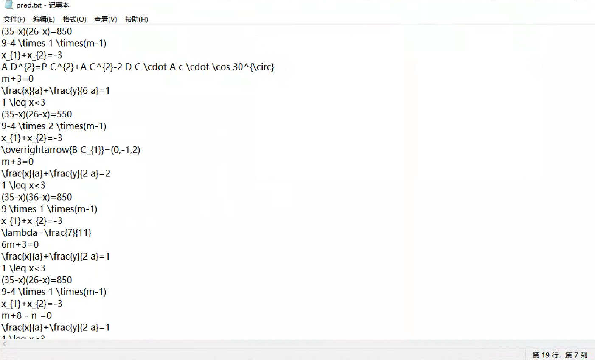
    </div>

    > 测试集的 `ID` 范围 `104011` ~ `105060`，所以第一行是 `ID` 为 `104011` 的图片对应的预测标签，第二行为 `104012`，以此类推。
- `姓名1_姓名2_model2_pred_v版本号.txt`: 规则类似上一个，区别在于是**模型 2** 在测试集上的预测结果。
- `姓名1_姓名2_complexity_v版本号.txt`: 第一行表示模型 1 的模型复杂度（单位 Mac），第二行表示模型 2 的模型复杂度。统一使用科学计数法，保留小数点后两位（如 1.03e10 Mac）

### 7.4 评价指标

1. BLEU Score (0~100; larger is better)

    ```python
    from nltk.translate.bleu_score import sentence_bleu
    bleu_score = 0.0
    for i,j in zip(references,hypotheses):
        bleu_score += max(sentence_bleu([i],j),0.01)
    bleu_score = bleu_score/len(references)*100
    ```

2. Edit Distance Score (0~100; larger is better)

    ```python
    def edit_distance(references, hypotheses):
        """Computes Levenshtein distance between two sequences.
        Args:
            references: list of sentences (one hypothesis)
            hypotheses: list of sentences (one hypothesis)
        Returns:
            1 - levenshtein distance: (higher is better, 1 is perfect)
        """
        d_leven, len_tot = 0, 0
        for ref, hypo in zip(references, hypotheses):
            d_leven += distance.levenshtein(ref, hypo)
            len_tot += float(max(len(ref), len(hypo)))

        return (1. - d_leven/len_tot)*100
    ```

3. Exact Match Score (0~100; larger is better)
每个样本完全匹配才算正确，计算公式如下

    ```
    Exact Match Score=Accuracy*100
    ```

1. Model Complexity Score (0~100; larger is better) 模型复杂度分数。复杂度增大则为 0 分，**复杂度不变则视为无效成绩**，复杂度减小 10% 则为 100 分：

    ```
    Model Complexity Score = MAX(0, MIN(100, (X - Model Complexity) / (0.1 * X) * 100))
    ```

    X 为改动前的模型复杂度值：

    - 模型一：1.03e10 Mac
    - 模型二：5.94e8 Mac

    注：若使用 2024 年后发表的新模型，则该部分的分数从 50 分起算。鼓励各位尝试前沿的模型

2. Overall Score (0~100; larger is better)
总体分数，指标1，2，3, 4的均值，最后排名的依据

    ```
    Overall Score = (BLEU Score + Edit Distance Score + Exact Match Score + Model Complexity Score) / 4
    ```

## 八，步骤七：准备答辩和提交材料

### 8.1 答辩
- 日期：12月22日（周日上午）
- 时间：8:30 ~ 12:30
- 地点：线下
- 时长：5分钟PPT + 3~5分钟提问
- 准备：PPT，实验报告，源代码等辅助材料

### 8.2 提交材料
- 截止时间：12月23日
- 收集形式：http://116.56.134.138/files/%E5%A4%A7%E4%BD%9C%E4%B8%9A/step7_%E7%AD%94%E8%BE%A9%E6%9D%90%E6%96%99%E4%B8%8A%E4%BC%A0/
- 提交格式：每位同学一个压缩包**序号_姓名.zip**（不需要交模型参数文件和数据集，没有特殊情况下压缩包大小限制在10MB以内），结构如下
```
.
└── 序号_姓名文件夹
    ├── 实验报告 # .docx/.doc/.pdf
    ├── 源代码（可选；提交个人负责部分的代码）# 文件夹/.zip
    └── 其他（可选；实验报告里面涉及的辅助材料） # 文件夹/.zip
```